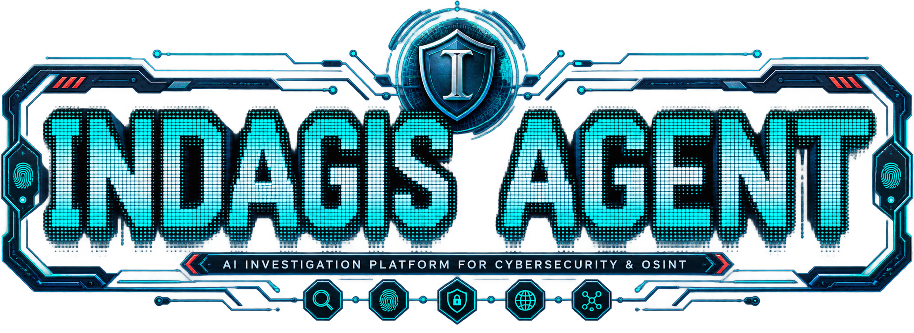

<p align="center">
  
</p>

# Indagis Agent

<p align="center">
  <a href="https://github.com/agtktID/indagis-agent"><b>Indagis Agent</b></a> (CLI &amp; gateway) &nbsp;·&nbsp; <a href="apps/desktop/README.md"><b>Indagis Desktop</b></a> (Electron app)
</p>

<p align="center">
  <a href="LICENSE"></a>
  <a href="https://github.com/agtktID/indagis-agent/actions/workflows/ci.yml"></a>
  
  <a href="https://github.com/agtktID/indagis-agent/stargazers"></a>
</p>

<p align="center">
  <a href="#quick-install"></a>
  <a href="https://github.com/agtktID/indagis-agent/tree/main/website/docs/"></a>
  <a href="#contributing"></a>
</p>

<p align="center">
  <b>An AI workspace for cybersecurity investigation</b> — OSINT, threat intel, and DFIR.
</p>

Indagis Agent has a closed learning loop: it creates skills from experience, improves them during use, nudges itself to persist knowledge, searches its own past conversations, and builds a deepening model of who you are across sessions. Run it on a $5 VPS, a GPU cluster, or serverless infrastructure that costs nearly nothing when idle. It's not tied to your laptop — talk to it from Telegram while it works on a cloud VM.

Use any model you want — OpenRouter, OpenAI, your own endpoint, and [many others](https://github.com/agtktID/indagis-agent/blob/main/website/docs/integrations/providers.md). Switch with `indagis model` — no code changes, no lock-in.

---

## Features

<table>
<tr><td><b>Authorization-gated investigations</b></td><td>Security work is tracked as a persisted <code>Investigation</code>: an objective, an authorized scope, evidence, findings and a timeline. Every recorded target is checked against that scope before it is written (fail-closed), with Markdown/JSON export.</td></tr>
<tr><td><b>An investigation command suite</b></td><td>Thirteen investigation subsystems — scope authorization, IOC correlation, a cross-case relationship graph, attribution scoring, evidence signing, sock puppets, bounty tracking, continuous recon and more — each a CLI command with a matching read-only desktop panel. <a href="#the-investigation-suite">See the table below</a>.</td></tr>
<tr><td><b>A real terminal interface</b></td><td>Full TUI with multiline editing, slash-command autocomplete, conversation history, interrupt-and-redirect, and streaming tool output.</td></tr>
<tr><td><b>Lives where you do</b></td><td>Telegram, Discord, Slack, WhatsApp, Signal, and CLI — all from a single gateway process. Voice memo transcription, cross-platform conversation continuity.</td></tr>
<tr><td><b>A closed learning loop</b></td><td>Agent-curated memory with periodic nudges. Autonomous skill creation after complex tasks. Skills self-improve during use. FTS5 session search with LLM summarization for cross-session recall. <a href="https://github.com/plastic-labs/honcho">Honcho</a> dialectic user modeling. Compatible with the <a href="https://agentskills.io">agentskills.io</a> open standard.</td></tr>
<tr><td><b>Scheduled automations</b></td><td>Built-in cron scheduler with delivery to any platform. Daily reports, nightly backups, weekly audits — all in natural language, running unattended.</td></tr>
<tr><td><b>Delegates and parallelizes</b></td><td>Spawn isolated subagents for parallel workstreams. Write Python scripts that call tools via RPC, collapsing multi-step pipelines into zero-context-cost turns.</td></tr>
<tr><td><b>Runs anywhere, not just your laptop</b></td><td>Seven terminal backends — local, Docker, SSH, Singularity, Modal, Daytona, and Vercel Sandbox. Daytona and Modal offer serverless persistence — your agent's environment hibernates when idle and wakes on demand, costing nearly nothing between sessions. Run it on a $5 VPS or a GPU cluster.</td></tr>
<tr><td><b>Research-ready</b></td><td>Batch trajectory generation, trajectory compression for training the next generation of tool-calling models.</td></tr>
</table>

---

## The investigation suite

Thirteen subsystems built for the work an investigator actually does. Each is a CLI command with a **read-only desktop panel** that renders it — the panel never writes, so nothing in the UI can mutate an investigation behind your back. Twelve own their state on disk; the thirteenth, the relationship graph, derives its whole view from what Case Memory has already indexed rather than adding a store of its own.

| Subsystem | Command | What it does |
| --- | --- | --- |
| **Scope Sync** | `indagis scope` | Import an authorized scope export from your bounty dashboard, then `scope check <target>` before you touch anything. **Out-of-scope always wins** over an in-scope match elsewhere. `scope autopilot` onboards every in-scope host onto continuous recon. |
| **Relationship Graph** | `indagis graph` | Which investigations are connected, through which indicators, and how strongly. An indicator seen in too many cases is reported but **links nothing** — everywhere means nowhere, and one banal address would otherwise wire every case together. |
| **Case Memory** | `indagis case` | One index of every IOC across every investigation, so an indicator seen in a new case surfaces the earlier case it came from. |
| **Attribution Confidence** | `indagis attribution` | Scores findings on the NATO/Admiralty scale (source reliability A–F × information credibility 1–6). A cross-case corroboration upgrades credibility, because an independent investigation *is* an independent source. |
| **Dossier Builder** | `indagis dossier build` | Renders an evidence store as a Markdown dossier, with a SHA-256 integrity re-check over every item. |
| **Custody Chain** | `indagis custody` | Ed25519 signing for evidence exports. The private key never leaves the machine — the dashboard only ever exposes key *names* and public keys. |
| **Image Intel** | `indagis image` | EXIF forensics on a photograph: GPS coordinates, capture timestamps, and the camera serial numbers that tie separate photographs to one physical device. `image scrub` writes a metadata-free copy for publication, always to a new path. |
| **Sock Puppet Manager** | `indagis puppet` | Bookkeeping for research personas: platform footprint, investigation, burn status. It records personas; it never creates accounts or content. |
| **Surface Diff** | `indagis surface` | Snapshots an attack surface (DNS, HTTP, HTTPS, TLS certificate) and diffs consecutive snapshots so drift is visible. |
| **Signal Watch** | `indagis watch` | Scheduled IOC/target watches delivered to any messaging platform. |
| **Breach Radar** | `indagis intel breach-email` · `breach-domain` | Breach exposure checks for an address or a domain. |
| **Bounty Ledger** | `indagis bounty` | Submissions, statuses and payouts. Payouts stay per-currency — nothing is summed across currencies, because no exchange rate exists in the stack. |
| **Air Gap** | `indagis airgap` | A confidential-engagement kill switch that holds outbound integrations. |

Plus **MCP Vetting Firewall** (`indagis mcp audit`) — a tool-poisoning scanner for MCP servers.

📖 Full syntax: **[Investigation Commands Reference](https://github.com/agtktID/indagis-agent/blob/main/website/docs/reference/investigation-commands.md)**

### Mission Control

The desktop app ships a **Mission Control** board that aggregates the whole suite into one operational overview: headline counts, per-subsystem readiness, coverage across the toolchain, and banners for the states that need to interrupt you (air gap engaged, scope exclusions in force).

It computes nothing of its own — every figure is read from the state module that already owns it, each subsystem is probed defensively so an unconfigured feature reads as *no data* rather than blanking the board, and readiness reflects real fields rather than a synthetic score.

All twelve panels ship **off by default** and are enabled individually under **Settings ▸ Plugins**.

---

## Quick Install

### Linux, macOS, WSL2, Termux

```bash
curl -fsSL https://raw.githubusercontent.com/agtktID/indagis-agent/main/scripts/install.sh | bash
```

### Windows (native, PowerShell)

> **Heads up:** Native Windows runs Indagis Agent without WSL — CLI, gateway, TUI, and tools all work natively. If you'd rather use WSL2, the Linux/macOS one-liner above works there too. Found a bug? Please [file issues](https://github.com/agtktID/indagis-agent/issues).

Run this in PowerShell:

```powershell
iex (irm https://raw.githubusercontent.com/agtktID/indagis-agent/main/scripts/install.ps1)
```

The installer handles everything: uv, Python 3.11, Node.js, ripgrep, ffmpeg, **and a portable Git Bash** (MinGit, unpacked to `%LOCALAPPDATA%\indagis\git` — no admin required, completely isolated from any system Git install). Indagis Agent uses this bundled Git Bash to run shell commands.

If you already have Git installed, the installer detects it and uses that instead. Otherwise a ~45MB MinGit download is all you need — it won't touch or interfere with any system Git.

> **Android / Termux:** The tested manual path is documented in the [Termux guide](https://github.com/agtktID/indagis-agent/blob/main/website/docs/getting-started/termux.md). On Termux, Indagis Agent installs a curated `.[termux]` extra because the full `.[all]` extra currently pulls Android-incompatible voice dependencies.

> **Where it installs:** native Windows uses `%LOCALAPPDATA%\indagis`; WSL2 uses `~/.indagis` as on Linux. An existing `%LOCALAPPDATA%\hermes` / `~/.hermes` from before the rename keeps being used — the installer prefers it over creating a second home, so upgrades stay in place.

After installation:

```bash
source ~/.bashrc    # reload shell (or: source ~/.zshrc)
indagis            # start chatting!
```

> **Antivirus flagged `uv.exe`?** It's a false positive on the bundled Astral `uv` binary. [How to verify and whitelist it →](https://github.com/agtktID/indagis-agent/blob/main/website/docs/user-guide/windows-native.md#antivirus-flags-uvexe-as-malware)

---

## Docker

There is no published Indagis image — the compose files build from this
checkout, so you always run this fork's code rather than upstream Hermes.

```bash
docker compose up -d
```

That starts the gateway and the dashboard, both mounting `~/.indagis` as the
container's data volume. On Windows use the dedicated file:

```bash
docker compose -f docker-compose.windows.yml up -d
```

Set `HERMES_UID` / `HERMES_GID` to your own host user (`id -u` / `id -g`) —
the container runs as UID 10000, and without the override the files it writes
into your mounted data directory are owned by that UID.

One-off commands run against the same image:

```bash
docker run --rm -v ~/.indagis:/opt/data indagis-agent --version
```

Inside the container the command is `indagis` (`hermes` stays as an alias).

---

## Getting Started

### First run

The installer sets up Python, Node and the agent itself, but Indagis still
needs a model provider before it can answer anything. Either run the wizard:

```bash
indagis setup        # walks through provider, keys and platform wiring
```

…or pick a provider directly with `indagis model` (OpenRouter, OpenAI, an
Anthropic key, or your own OpenAI-compatible endpoint). Configuration and
data live under `~/.indagis`.

If something looks wrong at any point, `indagis doctor` diagnoses it and
`indagis doctor --fix` repairs what it can.

### Everyday commands

```bash
indagis              # Interactive CLI — start a conversation
indagis model        # Choose your LLM provider and model
indagis investigation # Create and track a scoped investigation
indagis tools        # Configure which tools are enabled
indagis config set   # Set individual config values
indagis config get   # Print individual config values
indagis gateway      # Start the messaging gateway (Telegram, Discord, etc.)
indagis setup        # Run the full setup wizard (configures everything at once)
indagis claw migrate # Migrate from OpenClaw (if coming from OpenClaw)
indagis update       # Update to the latest version
indagis doctor       # Diagnose any issues
```

Investigation work has its own verbs:

```bash
indagis scope import <program> <file>   # Load an authorized scope export
indagis scope check <target>            # Am I allowed to touch this? (out-of-scope wins)
indagis case ingest <store>             # Index an evidence store into Case Memory
indagis graph show                      # Which cases are connected, and by what
indagis attribution score <store>       # Admiralty reliability × credibility
indagis dossier build <store>           # Render the case as a Markdown dossier
indagis image inspect <file>            # EXIF, GPS and device fingerprint from a photo
indagis surface snapshot <target>       # Snapshot an attack surface; diff on the next run
indagis watch create ...                # Schedule an IOC/target watch
indagis custody keygen <name>           # Ed25519 key for signing evidence exports
indagis airgap lockdown                 # Hold outbound integrations for a confidential job
```

Two of those are safety gates, so they are scriptable — they exit non-zero
when they refuse, and you can branch on which refusal it was:

```bash
indagis scope check "$target" && run_scan "$target"   # never scans an out-of-scope host
indagis custody verify case.json && ship_evidence     # never ships a tampered store
```

| Exit | `scope check`                        | `custody verify`                       |
| ---- | ------------------------------------ | -------------------------------------- |
| `0`  | in scope                             | signature valid                        |
| `1`  | **out of scope — do not test**       | **tampered, or signature invalid**     |
| `2`  | no rule matched — treat as out of scope | not signed, or could not be read     |

📖 **[Full documentation →](https://github.com/agtktID/indagis-agent/tree/main/website/docs/)**

---

## CLI vs Messaging Quick Reference

Indagis Agent has two entry points: start the terminal UI with `indagis`, or run the gateway and talk to it from Telegram, Discord, Slack, WhatsApp, Signal, or Email. Once you're in a conversation, many slash commands are shared across both interfaces.

| Action                         | CLI                                           | Messaging platforms                                                              |
| ------------------------------ | --------------------------------------------- | -------------------------------------------------------------------------------- |
| Start chatting                 | `indagis`                                     | Run `indagis gateway setup` + `indagis gateway start`, then send the bot a message |
| Start fresh conversation       | `/new` or `/reset`                            | `/new` or `/reset`                                                               |
| Change model                   | `/model [provider:model]`                     | `/model [provider:model]`                                                        |
| Set a personality              | `/personality [name]`                         | `/personality [name]`                                                            |
| Retry or undo the last turn    | `/retry`, `/undo`                             | `/retry`, `/undo`                                                                |
| Compress context / check usage | `/compress`, `/usage`, `/insights [--days N]` | `/compress`, `/usage`, `/insights [days]`                                        |
| Browse skills                  | `/skills` or `/<skill-name>`                  | `/<skill-name>`                                                                  |
| Interrupt current work         | `Ctrl+C` or send a new message                | `/stop` or send a new message                                                    |
| Platform-specific status       | `/platforms`                                  | `/status`, `/sethome`                                                            |

For the full command lists, see the [CLI guide](https://github.com/agtktID/indagis-agent/blob/main/website/docs/user-guide/cli.md) and the [Messaging Gateway guide](https://github.com/agtktID/indagis-agent/blob/main/website/docs/user-guide/messaging/index.md).

---

## Documentation

Documentation lives at **[website/docs/](https://github.com/agtktID/indagis-agent/tree/main/website/docs/)**. Indagis-specific docs (palette, the cybersecurity-investigation adaptations) will live at `website/docs/` in this repository once authored.

| Section                                                                                             | What's Covered                                             |
| --------------------------------------------------------------------------------------------------- | ---------------------------------------------------------- |
| [Quickstart](https://github.com/agtktID/indagis-agent/blob/main/website/docs/getting-started/quickstart.md)                 | Install → setup → first conversation in 2 minutes          |
| [CLI Usage](https://github.com/agtktID/indagis-agent/blob/main/website/docs/user-guide/cli.md)                              | Commands, keybindings, personalities, sessions             |
| [Configuration](https://github.com/agtktID/indagis-agent/blob/main/website/docs/user-guide/configuration.md)                | Config file, providers, models, all options                |
| [Messaging Gateway](https://github.com/agtktID/indagis-agent/blob/main/website/docs/user-guide/messaging/index.md)                | Telegram, Discord, Slack, WhatsApp, Signal, Home Assistant |
| [Security](https://github.com/agtktID/indagis-agent/blob/main/website/docs/user-guide/security.md)                          | Command approval, DM pairing, container isolation          |
| [Tools & Toolsets](https://github.com/agtktID/indagis-agent/blob/main/website/docs/user-guide/features/tools.md)            | 40+ tools, toolset system, terminal backends               |
| [Skills System](https://github.com/agtktID/indagis-agent/blob/main/website/docs/user-guide/features/skills.md)              | Procedural memory, Skills Hub, creating skills             |
| [Memory](https://github.com/agtktID/indagis-agent/blob/main/website/docs/user-guide/features/memory.md)                     | Persistent memory, user profiles, best practices           |
| [MCP Integration](https://github.com/agtktID/indagis-agent/blob/main/website/docs/user-guide/features/mcp.md)               | Connect any MCP server for extended capabilities           |
| [Cron Scheduling](https://github.com/agtktID/indagis-agent/blob/main/website/docs/user-guide/features/cron.md)              | Scheduled tasks with platform delivery                     |
| [Context Files](https://github.com/agtktID/indagis-agent/blob/main/website/docs/user-guide/features/context-files.md)       | Project context that shapes every conversation             |
| [Architecture](https://github.com/agtktID/indagis-agent/blob/main/website/docs/developer-guide/architecture.md)             | Project structure, agent loop, key classes                 |
| [Contributing](https://github.com/agtktID/indagis-agent/blob/main/website/docs/developer-guide/contributing.md)             | Development setup, PR process, code style                  |
| [CLI Reference](https://github.com/agtktID/indagis-agent/blob/main/website/docs/reference/cli-commands.md)                  | All commands and flags                                     |
| [Investigation Commands](https://github.com/agtktID/indagis-agent/blob/main/website/docs/reference/investigation-commands.md) | Case Memory, Relationship Graph, Dossier Builder, Attribution Scoring, Image Intel, Sock Puppet Manager, Bounty Ledger, Scope Sync, Air Gap, Custody Chain, Surface Diff, Signal Watch, MCP Vetting Firewall |
| [Environment Variables](https://github.com/agtktID/indagis-agent/blob/main/website/docs/reference/environment-variables.md) | Complete env var reference                                 |

---

## Coming from another agent

`indagis setup` detects an existing `~/.openclaw` and offers to migrate before
configuration begins. Anytime after install, `indagis claw migrate --dry-run`
previews what would move — persona, memories, skills, approval patterns,
messaging config and TTS assets. **No preset imports API keys silently**;
that needs an explicit `--migrate-secrets`.

Migrating from **Claude Code** or **OpenAI Codex CLI** instead? That's
`indagis import-agent`, same preview-first flow.

📖 [Migrate from OpenClaw](https://github.com/agtktID/indagis-agent/blob/main/website/docs/guides/migrate-from-openclaw.md) · [Import from other agents](https://github.com/agtktID/indagis-agent/blob/main/website/docs/user-guide/import-from-other-agents.md)

---

## Contributing

We welcome contributions! See the [Contributing Guide](https://github.com/agtktID/indagis-agent/blob/main/website/docs/developer-guide/contributing.md) for development setup, code style, and PR process.

Run the standard installer, then work from the git checkout it creates at
`$INDAGIS_HOME/hermes-agent` — that layout is what `indagis update`, the managed
venv, the gateway and the docs tooling all expect.

```bash
curl -fsSL https://raw.githubusercontent.com/agtktID/indagis-agent/main/scripts/install.sh | bash
cd "${INDAGIS_HOME:-$HOME/.indagis}/hermes-agent"
uv pip install -e ".[all,dev]"
scripts/run_tests.sh
```

> If you clone manually instead, put the venv **outside** the source tree. A venv
> inside the directory the agent operates on can be wiped by a relative-path
> command the agent runs against its own checkout — destroying the runtime
> mid-session.

---

## Community

- 📚 [Skills Hub](https://agentskills.io)
- 🐛 [Indagis Agent issues](https://github.com/agtktID/indagis-agent/issues)
- 🔌 [computer-use-linux](https://github.com/avifenesh/computer-use-linux) — Linux desktop-control MCP server for Indagis Agent (and other MCP hosts), with AT-SPI accessibility trees, Wayland/X11 input, screenshots, and compositor window targeting.

---

## License

MIT — see [LICENSE](LICENSE).

---

## Fondations

**Indagis is an independent, community-maintained project.** It is built on a modified agent core (the `agent/`, `providers/`, `tools/`, `gateway/`, `skills/` modules in this repository), licensed under MIT — see [LICENSE](LICENSE). The presentation layer — shell, themes, palette, dashboard login, and a small set of user-facing strings — has been custom-built for the [Indagis](https://github.com/agtktID/indagis-agent) identity, designed for cybersecurity investigation workflows (SOC, DFIR, threat hunting, evidence collection).

### Roadmap — cybersecurity-specialised skills

This differentiation lives in the **skill library**, under `skills/security/` (bundled, active by default) and `optional-skills/security/` (opt-in). This roadmap lists the cybersecurity-specialised skills built for the Indagis skill catalog. Each entry is a self-contained skill that wraps an existing CLI or API and an LLM-facing prompt — the agent invokes the skill, the skill wraps the tool, no custom Python integration is required. The skill engine handles all of these without modification.

| Skill | Domain | Wraps | Status |
|---|---|---|---|
| `shodan-search` | Recon | Shodan REST API | Shipped — bundled |
| `misp-query` | Threat intel | MISP REST API (`pymisp` or `curl`) | Shipped — optional |
| `virustotal-lookup` | Threat intel | VirusTotal v3 API | Shipped — bundled |
| `sigma-rule-search` | Detection engineering | `sigma-cli` or PyPI `sigma` | Shipped — bundled |
| `yara-scan` | File / memory scanning | `yara` CLI | Shipped — bundled |
| `mitm-traffic-capture` | Recon / API traffic capture | `mitmproxy` CLI | Shipped — optional |
| `mitm-traffic-audit` | API security / bug-bounty methodology | `mitmproxy` capture + `curl` | Shipped — optional |
| `dfir-toolkit` | Memory / disk forensics | Volatility3 (`vol`) + The Sleuth Kit (`mmls`, `fls`, `icat`, …) | Shipped — optional |
| `mvt-android-triage` | Mobile DFIR | MVT (Mobile Verification Toolkit) CLI | Planned (Phase 5) |
| `velociraptor-hunt` | DFIR / endpoint | Velociraptor `velociraptor` CLI | Planned (Phase 5) |
| `osquery-investigate` | Endpoint live forensics | `osqueryi` shell | Planned (Phase 5) |
| `wireshark-tshark` | Network forensics | `tshark` / `editcap` | Planned (Phase 5) |
| `chainsaw-evtx` | Log forensics (Windows EVTX) | Chainsaw CLI | Planned (Phase 5) |

Shipped skills land as standalone `SKILL.md` + `references/` files (the format documented in `CONTRIBUTING.md`, reviewed against its Skill-vs-Tool decision criteria). The **bundled** ones live under `skills/security/` and are active from install — no setup step required. The **optional** ones live under `optional-skills/security/` and ship with the repo but aren't activated by default; install one with `indagis skills install official/security/<name>`. The remaining entries are still planned.

**Status of shipped skills today:** of the 8 shipped roadmap entries above, 4 — `shodan-search`, `virustotal-lookup`, `sigma-rule-search`, `yara-scan` — are bundled and active by default; `misp-query`, `mitm-traffic-capture`, `mitm-traffic-audit`, and `dfir-toolkit` stay optional (they need a MISP instance, an active mitmproxy capture, or heavyweight forensics tooling on `PATH` — not a fit for a default loadout). Outside this roadmap table, `sherlock`, `domain-intel`, `osint-investigation`, and the three identity-pivot skills — `phone-intel`, `email-permute`, `handle-pivot` — are also bundled under `skills/security/`. The identity three wrap no external tool at all: they are Python-stdlib scripts with no API key, no network call and no new dependency, which is why they are bundled rather than optional and why they still work under `indagis airgap lockdown`. `1password`, `oss-forensics`, `web-pentest`, `godmode`, and `unbroker` stay optional for their own credential, legal, or active-action reasons. The remaining 5 roadmap entries are still planned; operators who want to test one early should file an issue with the workflow they want to automate.

The engine (agent runtime, provider abstraction, gateway, skills scheduler, session persistence) is kept as-is at the fork point so security and bug fixes can still be reviewed and merged in — the fork's own work is the presentation layer (CLI banner, dashboard, desktop app, TUI, palette) and the cybersecurity skill library above. A handful of internal-only technical identifiers (an installer env var, an Electron bundle id, a couple of module directory names) are intentionally not yet renamed for install-compatibility reasons — see `CHANGELOG.md` for the full technical log if you're touching that code.
